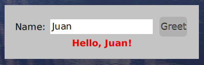

# Suggested chapters

## Overview

The standard Cuis package for building user interfaces is Morphic 3.
The classes provided by this package are in the class category "Morphic".
What non-Smalltalk GUI libraries refer to as "components" or "widgets"
are called "morphs" in Cuis.

There are many provided morphs that are subclasses of the class `Morph`
and it's easy to create custom morphs.

The primary way of organizing morphs is to create instances of `LayoutMorph`
and add submorphs to them.
Instances of `LayoutMorph` can be nested to achieve pretty much any layout.

## Quick Start

Open a Workspace and evaluate the following expressions.

```smalltalk
box := ColoredBoxMorph new.
box color: Color pink.
box morphExtent: 200 @ 100.
box openInWorld.
```

This renders a pink rectangle.
Open the halo for this morph by holding down a key and clicking it.
The key to hold down depends on your platform.
It is the command key in macOS and the control key in other platforms.
Click the red button in the upper-left of the halo to remove the morph.

## Learn how to layout components

A GUI is a place where several interactive and non-interactive components
are laid out together.
Designing a new GUI starts by thinking how to pack together its components.
This chapter explain how layout works in Cuis.

Rendering a single morph isn't particularly interesting.
Let's render some labels, a text input, and a button
to implement a simple application.



1. Create a class category named `Demo`.

1. Create a class in that category named `HelloWorld`
   that is a subclass of `LayoutMorph`.

   ```smalltalk
   LayoutMorph subclass: #HelloWorld
       instanceVariableNames: 'greetingLabel input'
       classVariableNames: ''
       poolDictionaries: ''
       category: 'Morf'
   ```

1. Add the following class method:

   ```smalltalk
   new

       ^ self newColumn
   ```

1. Add the following instance method:

   ```smalltalk
   initialize
        | button font row |

        super initialize. "DON'T FORGET THIS!"

        "Create a single-line text input.
        Using zero for the height causes it to calculate
        the minimum required height for a single line."
        input := TextModelMorph withText: '' ::
            hideScrollBarsIndefinitely;
            morphExtent: 200 @ 0;
            wrapFlag: false.

        "Create a button that when clicked sends
        the message #greet to the current object."
        button := PluggableButtonMorph model: self action: #greet.
        button label: 'Greet'.

        row := LayoutMorph newRow
            gap: 10;
            addMorph: (LabelMorph contents: 'Name:');
            addMorph: input;
            addMorph: button.

        font := FontFamily defaultFamilyAndPointSize.
        greetingLabel := LabelMorph contents: '' ::
            color: Color red;
            font: font bold.

        self
            padding: 20;
            addMorph: row;
            addMorph: greetingLabel.
   ```

1. Add the following instance method:

   ```smalltalk
   greet
       "Update greetingLabel with a message
       that includes text from the input."
       | name |

       name := input text.
       greetingLabel contents: 'Hello, ', name, '!'
   ```

1. Evaluate the following expression in a Workspace:

   ```smalltalk
   HelloWorld new openInWorld.
   ```

1. Enter a name in the text input and click the "Greet" button.

## Creating a Window

Let's change the simple "Hello World" app we've built
so it can be inside a window that is opened from the World menu.

TODO: Add steps here.

## Useful design patterns for GUI

If not carefully designed to separate responsibilities, a GUI application code can quickly becomes a mess. In this chapter, we present the MVP pattern to separate responsibilities between Model, View and Presenter. It is a minimal approach on How to implement the MVP pattern with Cuis.

## What and Where?

Which widgets to use in the standard image? Where to find additional widgets?

## Advanced design patterns in GUI design

Advanced design patterns useful in GUI design: Tools, Command
